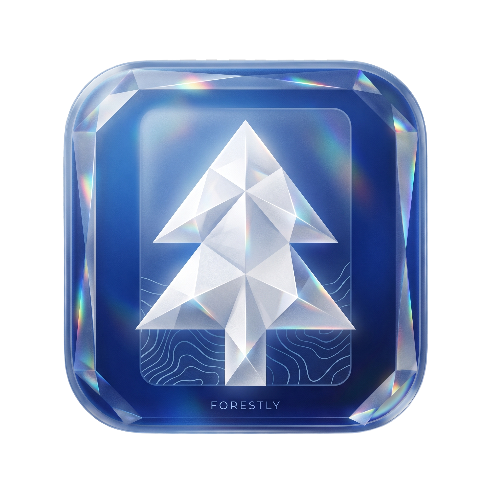

<p align="center">
  
</p>

<h1 align="center">MIETEK v2 <sub>by FORESTLY</sub></h1>

<p align="center">
  <b>Edytor taksacji leśnej</b><br>
  Rejestr, opisy taksacyjne i wydruki MIETKA — w przeglądarce, bez MS-DOS.<br>
  <sub>Część ekosystemu <a href="https://github.com/wskakuj/FORESTLY">Forestly</a></sub>
</p>

<p align="center">
  
  
  
</p>

---

## Co to jest

**MIETEK v2 by FORESTLY** to nowoczesny edytor danych taksacyjnych, który czyta i zapisuje
pliki MIETKA (`.DBF`, słowniki `.LST`) i generuje wydruki zgodne z oryginałem — ale w
interfejsie webowym, w szacie graficznej Forestly („Aurora Glass", motyw ciemny i jasny).

Wszystko działa **lokalnie** — żadnych kont, chmur ani wysyłania danych. Pliki zostają
na Twoim komputerze.

## Funkcje

| | Funkcja |
|---|---|
| **Edytor taksacji** | Opis `OP_TAX` w siatce 7 × 35 znaków, kafelki (drzewostan, zwarcie, podszyt…), podgląd zapisu i wydruku |
| **Rejestr W/D** | Właściciele i działki w jednej tabeli, sortowanie (nr rej. / nazwisko), regulacja szerokości kolumn, współwłaściciele w ramkach |
| **Wydruki MIETKA** | Osiem wydruków 1:1 z oryginałem: OPTAX, REJESTR, ZEST, HALIZNY, TAB_KLW, WSKAZ, WSK_ZB, WYK_NEG — podgląd + zapis `.TXT` (CP852) |
| **Druk** | OPTAX / REJESTR / TAB_KLW / WSKAZ poziomo, pozostałe pionowo; każdy nagłówek na nowej stronie |
| **Zapis do DBF** | ZIP z nadpisanymi `.DBF` oraz kopiami `.BAK` |
| **Dane wsi** | Edycja rekordu `WSIE` z polami daty |

## Jak uruchomić

**Najprościej (bez instalacji):** dwuklik na `uruchom.bat` — otwiera aplikację w przeglądarce.

**Natywne okno (EXE):** uruchom `zrob_repo.bat` — utworzy repo na GitHubie, uruchomi
budowę w GitHub Actions i pobierze `MIETEK v2 by FORESTLY.exe` do folderu `dist\`.
Wymaga jednorazowo:

```bat
winget install --id GitHub.cli
gh auth login
```

**Budowa lokalna:** `build.bat` (wymaga Pythona 3.10+).

## Struktura

```
MIETEK-v2/
├─ app/main.py              # launcher okienkowy (pywebview)
├─ webapp/index.html        # cała aplikacja (self-contained, offline)
├─ forestly.ico             # ikona (spójna z Forestly)
├─ zrob_repo.bat            # repo + budowa EXE na GitHub Actions
├─ build.bat                # budowa EXE lokalnie
└─ uruchom.bat              # szybkie uruchomienie w przeglądarce
```

## Licencja

Prywatna — część ekosystemu Forestly.
